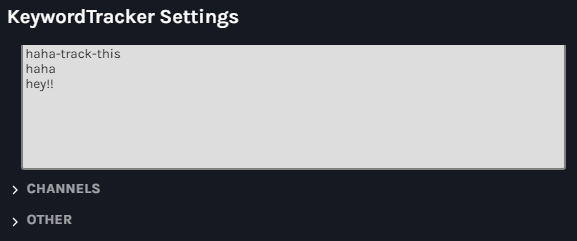
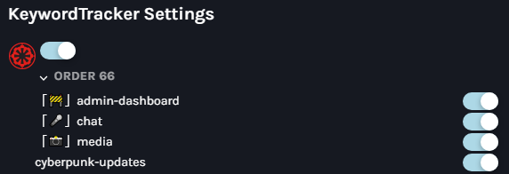
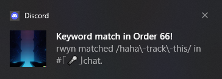
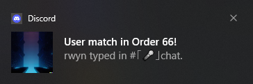
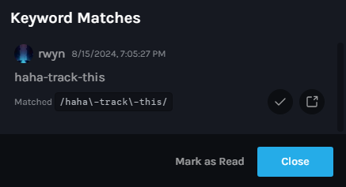

# KeywordTracker - Original plugin by [SarahKittyy](https://github.com/sarahkittyy/KeywordTracker)

KeywordTracker allows you to set keywords. Watching servers when you are online, so that you get a notification when the specified word/s is triggered. Needless to say, plugin won't collect messages unless you are online.

This plugin is built off [zlib](https://github.com/rauenzi/BDPluginLibrary).
## Features
* Set a specific user ID to get a notification when they send a message in any server.
* Set specific word/s to get a notification when someone triggers it.
* Notifications will stay in your inbox until you mark them in case you were AFK at the moment.
* You can exclude servers, channels or users.

## Screenshots

### ➤ Keyword Panel

### ➤ Channel Panel

### ➤ Notifications
A few examples of how it looks:

#### I. Text Notification

#### II. User Notification

#### III. In Your Inbox

## Contribution
Those who wants to contribute, please visit [SarahKittyy's Repo.](https://github.com/sarahkittyy/KeywordTracker)